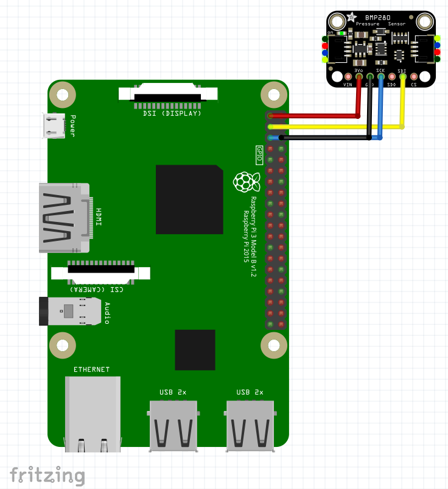
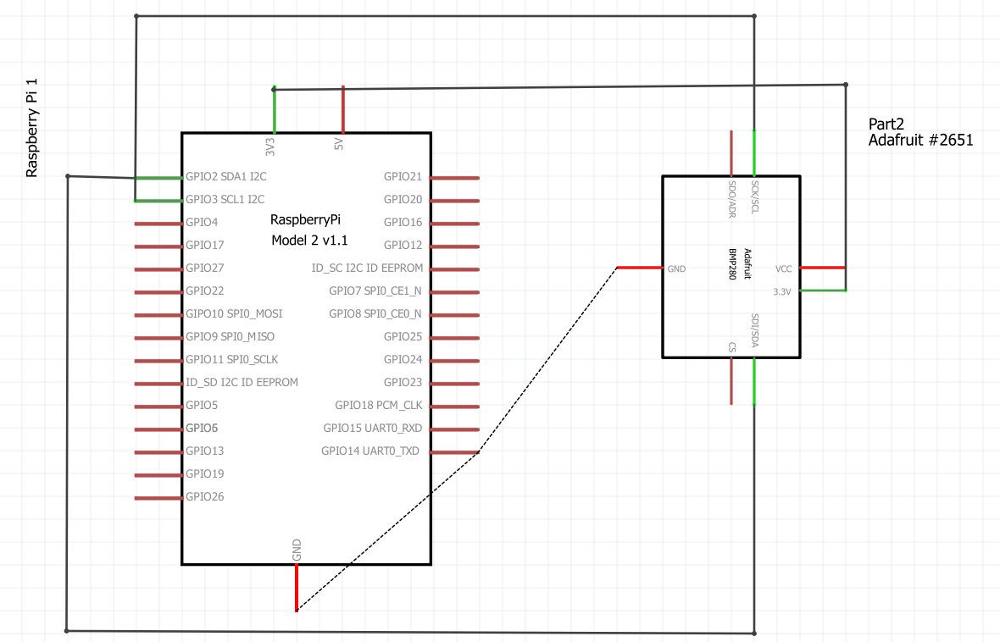
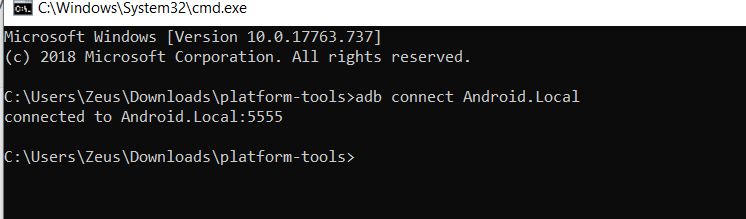

# solo-project-danielgogozan overview
In this project I will try to create an Android Things app that reads and displays temperature and pressure from a BMP280 sensor connected to Raspberry Pi 3 model B.
The demo can be accessed here: https://www.youtube.com/watch?v=auqCi_-O08Y
# Pre-requisites
- Raspberry PI 3 model B
- BMP280 sensor
- Android Studio

# Schematics

# Setup and Build Plan 
To setup, follow these steps below.
1. Install Android Things OS on your Raspberry PI 3 model B. (check documentation here: https://developer.android.com/things/hardware/raspberrypi)
2. Connect the sensor to the board as shown above in Schematics.
3. With an USB cable connect the board to your PC.
4. Run in cmd "adb connect Android.Local". 
 
5. Run the project (SensorActivity) from Android Studio and you should be able to see the temperature and pressure output.
